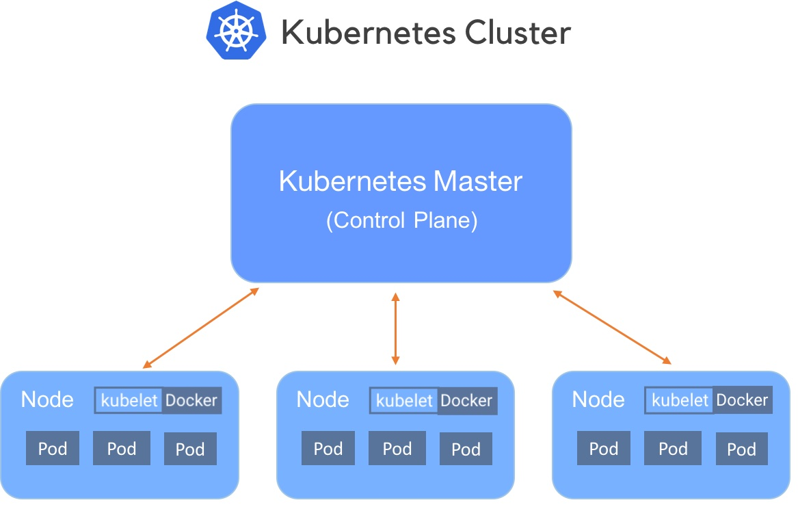
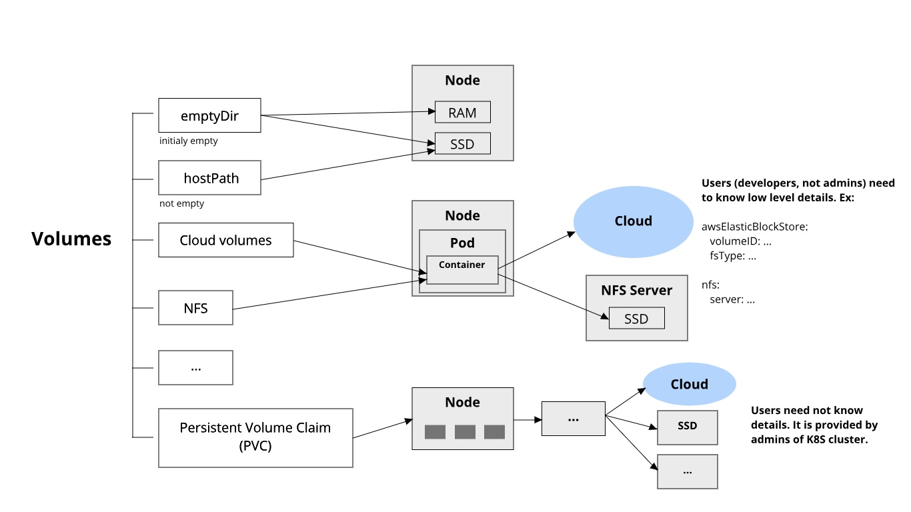

# Container orchestration | with Kubernetes

The portability and reproducibility of a containerized process mean we have an opportunity to move and scale our containerized applications across clouds and data centers. Containers effectively guarantee that those applications run the same way anywhere, allowing us to quickly and easily take advantage of all these environments. Furthermore, as we scale our applications up, we’ll want some tools to help automate the maintenance of those applications, able to replace failed containers automatically and manage the rollout of updates and reconfigurations of those containers during their lifecycle. Tools to manage, scale, and maintain containerized applications are called **orchestrators**.

## Requirements for Container-Based applications

- manage containers
- ensure that there is no downtime (SLA requirement)
  
## Container orchestration tools provide

- deployment
- management
- scaling
- networking

## Containers complexity

- Provisioning and deployment
- Configuration and scheduling 
- Resource allocation
- Container availability 
- Scaling or removing containers based on balancing workloads across your infrastructure
- Load balancing and traffic routing 
- Monitoring container health
- Configuring applications based on the container in which they will run
- Keeping interactions between containers secure

## Container orchestration tools

- **Kubernetes**
- Docker Compose (has limited functionality)
- Docker Swarm
- Apache Mesos

## Kubernetes 

**Kubernetes** - an open-source system for automating deployment, scaling, and management of containerized applications.

**Provides:**

- Automated rollouts and rollbacks
- Service health monitoring
- Automatic scaling of services
- Declarative management
- Deploy anywhere, including hybrid deployments
- Storage orchestration

## Kubernetes cluster

Consists of:

- **Master** - coordinates the cluster
- **Nodes** - workers that run applications



## Kubernetes objects

**Kubernetes objects** - persistent entities in the Kubernetes system. Kubernetes uses these entities to represent the state of the cluster:

- Running containers
- Available resources
- Policies

**Objects:**

- Pod
- Deployment
- Service
- ...

[Read more about Kubernetes objects](https://kubernetes.io/docs/concepts/overview/working-with-objects/kubernetes-objects/)

## Kubernetes Objects: Pods

**Pods** are (an abstraction of containers):

- the smallest deployable units of computing
- group of one or more containers (tightly coupled)
- could be *replicated* (scaled horizontally)
- ephemeral, disposable entities (The Pod remains on the node until the Pod finishes execution, the Pod object is deleted, the Pod is evicted for lack of resources, or the node fails.)

Example of `.yaml` (or `.yml`) file:

```yaml
apiVersion: v1
kind: Pod
metadata:
  name: redis
spec:
  containers:
  - name: redis
    image: redis
    volumeMounts:
    - name: redis-storage
      mountPath: /data/redis
  volumes:
  - name: redis-storage
    emptyDir: {}
```

## Kubernetes Objects: Deployment

Provides declarative updates for Pods (an abstraction of Pods).

You describe a **desired state** in a Deployment, and the Deployment Controller changes the actual state to the desired state.

Example:

```yaml
apiVersion: apps/v1
kind: Deployment
metadata:
  name: nginx-deployment
spec:
  selector:
    matchLabels:
      app: nginx
  replicas: 2 # tells deployment to run 2 pods matching the template
  template:
    metadata:
      labels:
        app: nginx
    spec:
      containers:
      - name: nginx
        image: nginx:1.14.2
        ports:
        - containerPort: 80
```

[Read more](https://kubernetes.io/docs/concepts/workloads/pods/)

## Kubernetes Objects: Service

An abstract (abstraction of network) way to expose an application running on a set of Pods **as a network service**.

With Kubernetes you don't need to modify your application to use an unfamiliar service discovery mechanism. Kubernetes gives Pods their own IP addresses and a single DNS name for a set of Pods and can load-balance across them.

Example:

```yaml
apiVersion: v1
kind: Service
metadata:
  name: my-service
spec:
  selector:
    app: nginx
  ports:
    - protocol: TCP
      port: 80
      targetPort: 9376
```

## Kubernetes object management

| Management technique             | Operates on          |Recommended environment |
|----------------------------------|----------------------|------------------------|
| Imperative commands              | Live objects         | Development projects   |
| Imperative object configuration  | Individual files     | Production projects    |
| Declarative object configuration | Directories of files | Production projects    |

**Examples:**

Imperative commands:
```
kubectl create deployment nginx --image nginx
```

Imperative object configuration:

```
kubectl create -f nginx.yaml
kubectl delete -f nginx.yaml -f redis.yaml
```

Declarative object configuration:
```
kubectl apply -f path/to/folder/
```

[Read more](https://kubernetes.io/docs/concepts/overview/working-with-objects/object-management/)

## Organizing resource configurations

```
project/k8s/development
├── deployment
│   └── my-deployment.yaml
└── service
    └── my-service.yaml
```

[Read more about managing resources](https://kubernetes.io/docs/concepts/cluster-administration/manage-deployment/)

## Networking

Communications types:

1. Highly-coupled container-to-container   
  Solved by Pods and `localhost`
2. Pod-to-Pod   
  Pods on a node can communicate with all pods on all nodes
3. Pod-to-Service   
  Covered by Services
4. External-to-Service   
  Covered by Ingress

[Read more](https://kubernetes.io/docs/concepts/cluster-administration/networking/)

## Storage in Kubernetes

On-disk files in a container are ephemeral, which presents some problems for non-trivial applications when running in containers. One problem is the loss of files when a container crashes. The kubelet restarts the container but with a clean state. A second problem occurs when sharing files between containers running together in a Pod. The Kubernetes volume abstraction solves both of these problems.

## Storage in Kubernetes: Volumes in Docker

- is simply a directory on disk or in another Container
- lifetimes are not managed

## Storage in Kubernetes: Kubernetes Volumes

- has an explicit lifetime - the same as the Pod that encloses it
- a volume outlives any Container that runs within the Pod
- when a Pod ceases to exist, the volume will cease to exist, too. 
- Kubernetes supports many types of volumes, and a Pod can use any number of them simultaneously.

[Read more](https://kubernetes.io/docs/concepts/storage/volumes/)

## Storage in Kubernetes: Kubernetes Volume types



## Storage in Kubernetes: `emptyDir` type

```yaml
apiVersion: v1
kind: Pod
metadata:
  name: redis
spec:
  containers:
  - name: redis
    image: redis
    volumeMounts:
    - name: redis-storage
      mountPath: /data/redis
  volumes:
  - name: redis-storage
    emptyDir: {}
```

## Storage in Kubernetes: `awsElasticBlockStore` type

```yaml
apiVersion: v1
kind: Pod
metadata:
  name: test-ebs
spec:
  containers:
  - image: k8s.gcr.io/test-webserver
    name: test-container
    volumeMounts:
    - mountPath: /test-ebs
      name: test-volume
  volumes:
  - name: test-volume
    # This AWS EBS volume must already exist.
    awsElasticBlockStore:
      volumeID: "<volume id>"
      fsType: ext4
```

## Storage in Kubernetes: Persistent Volumes

Provides an API for users and administrators that abstracts details of how storage is provided from how it is consumed.

2 parts:

1. **PersistentVolume (PV)** - a piece of storage in the cluster that has been **provisioned by an administrator**. It has a life cycle independent of any individual Pod that uses the PV.

```yaml
apiVersion: v1
kind: PersistentVolume
metadata:
  name: task-pv-volume
  labels:
    type: local
spec:
  storageClassName: manual
  capacity:
    storage: 10Gi
  accessModes:
    - ReadWriteOnce
  hostPath:
    path: "/mnt/data"
```

2. **PersistentVolumeClaim (PVC)** - a request for storage **by a user**.

```yaml
apiVersion: v1
kind: PersistentVolumeClaim
metadata:
  name: task-pv-claim
spec:
  storageClassName: manual
  accessModes:
    - ReadWriteOnce
  resources:
    requests:
      storage: 3Gi
```

Then, use the PVC in a Pod, for example:

```yaml
apiVersion: v1
kind: Pod
metadata:
  name: task-pv-pod
spec:
  volumes:
    - name: task-pv-storage
      persistentVolumeClaim:
        claimName: task-pv-claim
  containers:
    - name: task-pv-container
      image: nginx
      ports:
        - containerPort: 80
          name: "http-server"
      volumeMounts:
        - mountPath: "/path/to"
          name: task-pv-storage
```

[Read more](https://kubernetes.io/docs/concepts/storage/persistent-volumes/)

## Minikube

- Tool that makes it easy to run Kubernetes locally
- Runs a single-node Kubernetes cluster inside a Virtual Machine (VM)
- Perfect to get started with Kubernetes or develop locally

## References

- [Kubernetes concepts](https://kubernetes.io/docs/concepts/)
- [Katakoda - Learn Kubernetes using Interactive Browser-Based Scenarios](https://www.katacoda.com/courses/kubernetes)
